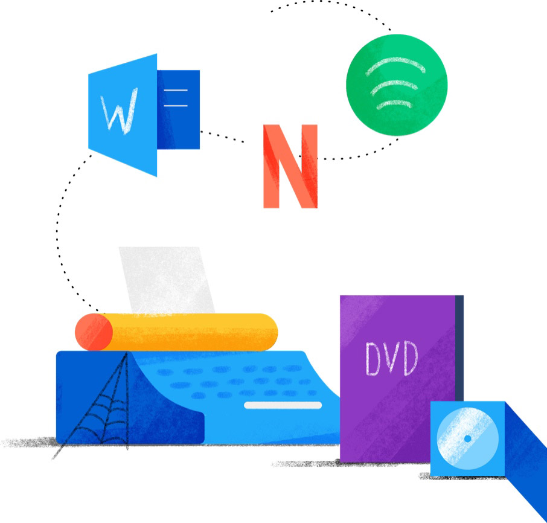
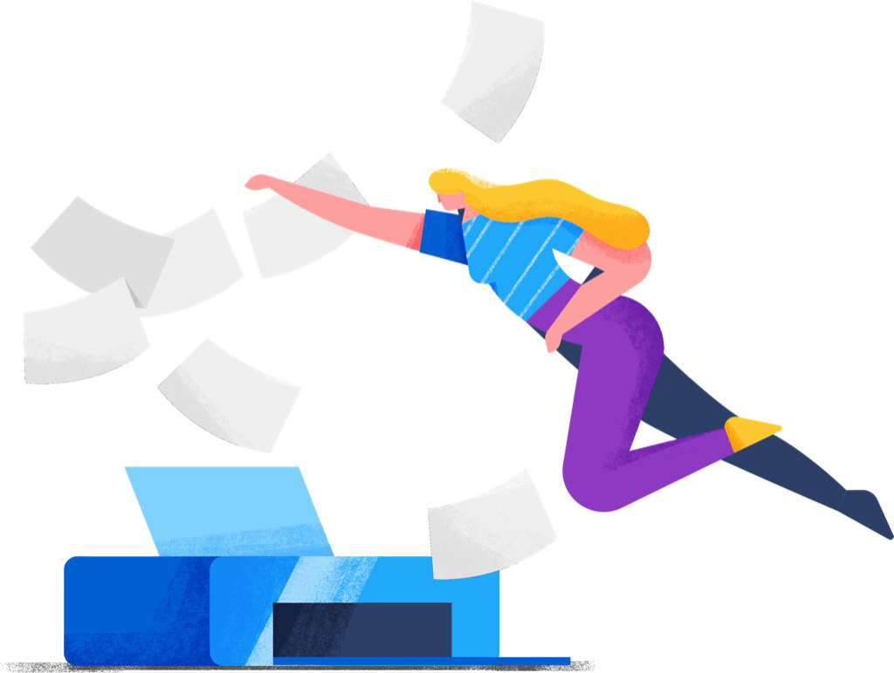

# Skribble builds trust in the digital world
Once upon a time there was the hand-written signature – today we sign with Skribble.

## The typewriter became Microsoft Word, the CD turned into Spotify, the DVD became Netflix.

Digitalisation makes many things faster, cheaper and simpler. This also applies to everyday business for at least 90 percent of processes.

The remaining ten percent are steps which require a high degree of trust, for example signing employment contracts. Many companies still rely on established analogue processes for this, as the digital way would represent an enormous additional expenditure if it has to comply with legal requirements. At least up to now.

## Skribble wants to change this:

Contracts should no longer have to take the detour via printer and paper to be legally signed:

With Skribble, signature processes are handled 100% digitally, based on the qualified electronic signature "QES" - the e-signature, which is equivalent to the hand-written signature according to Swiss and EU law.

Security does not come at the expense of simplicity: every company, regardless of size and technological know-how, should be able to benefit from the advantages of digital transformation.

## And that's just the beginning:
Building trust in digital business relationships should become as simple and intuitive as toasting bread. Since its founding in 2018, a growing team of Trust Shapers has been working towards this future.
